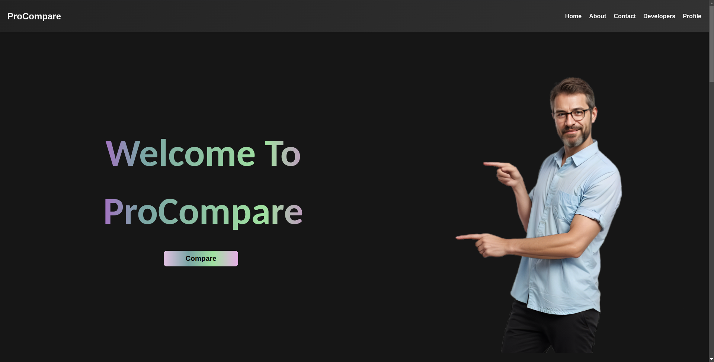
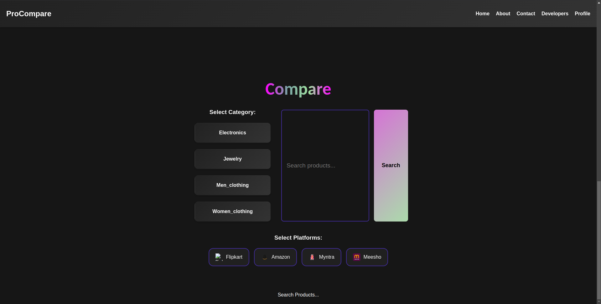
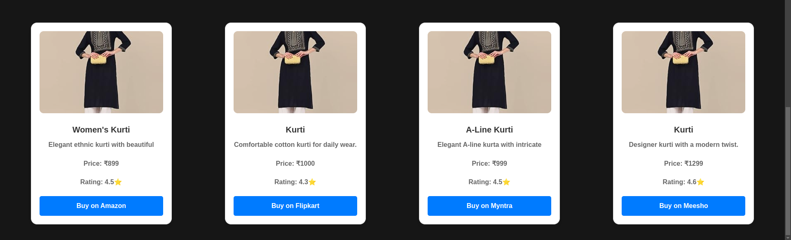
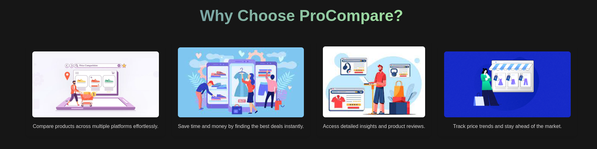

# E-Commerce Product Comparison Web 

## Description

This project is an **e-commerce product comparison website** built with **React** and **Node.js**. The website allows users to compare products across multiple online marketplaces such as **Flipkart**, **Amazon**, and **Myntra**. Due to API access restrictions from these platforms, mock data is currently used to simulate the product comparison. In the future, if API keys are obtained, the product data will be dynamically fetched, making the comparison even more accurate and up-to-date.

## 🖼️ Screenshots

### Home Page



### Product Comparison Page




## Features


- **User Authentication**: Login and registration functionality.
- **Responsive Design**: The website is designed to be fully responsive for optimal viewing on both mobile and desktop devices.
- **Product Comparison**: Users can compare products across categories such as electronics, clothing, etc., displayed in a grid layout.
- **Developer Profiles**: View profiles of developers with an interactive UI section.
- **Dark Theme**: A dark theme UI with smooth user transitions and RGB effects for a modern user experience.
- **Interactive Interface**: Real-time comparison updates with user-friendly navigation.

## Technologies Used

- **Frontend**:
  - **React** (for building the user interface)
  - **CSS** & **HTML** (for layout and styling)
  - **React Router** (for navigation)
  - **Axios** (for making HTTP requests)
  
- **Backend**:
  - **Node.js** (for the server-side logic)
  - **Express** (for creating the API and handling routes)
  

- **Others**:
  - **MongoDB** (for storing user authentication data)
  - **JWT** (for user authentication)

## Installation

### Prerequisites

Make sure you have **Node.js** and **npm** installed. If not, you can install them from [here](https://nodejs.org/).
give next content from here

### Setup

1. Clone the repository:

   ```bash
   git clone https://github.com/chaudhariGaurav07/Product-Compare.git
   cd Product-Compare
2. Install frontend dependencies:
   
   ```bash
   cd frontend
   npm install
3. Install backend dependencies:
   
   ```bash
   cd backend
   npm install
4. Set up environment variables for the backend (create a .env file in the server folder):
   
   ```bash
   PORT=5000
   DB_URI=your-mongodb-uri
   JWT_SECRET=your-jwt-secret
5. Run both the frontend and backend:
   
   ```bash
   //Start the frontend (client side):
   cd frontend
   npm start
   //Start the backend (server side):
   cd backend
   node server.js


6. 🚀 Running the Project
Once both the frontend and backend are running, open your browser and go to:

   ```bash
   http://localhost:3000 🚀

